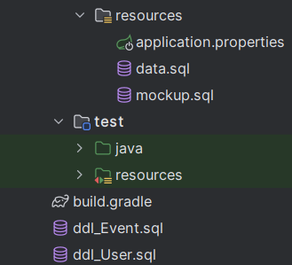
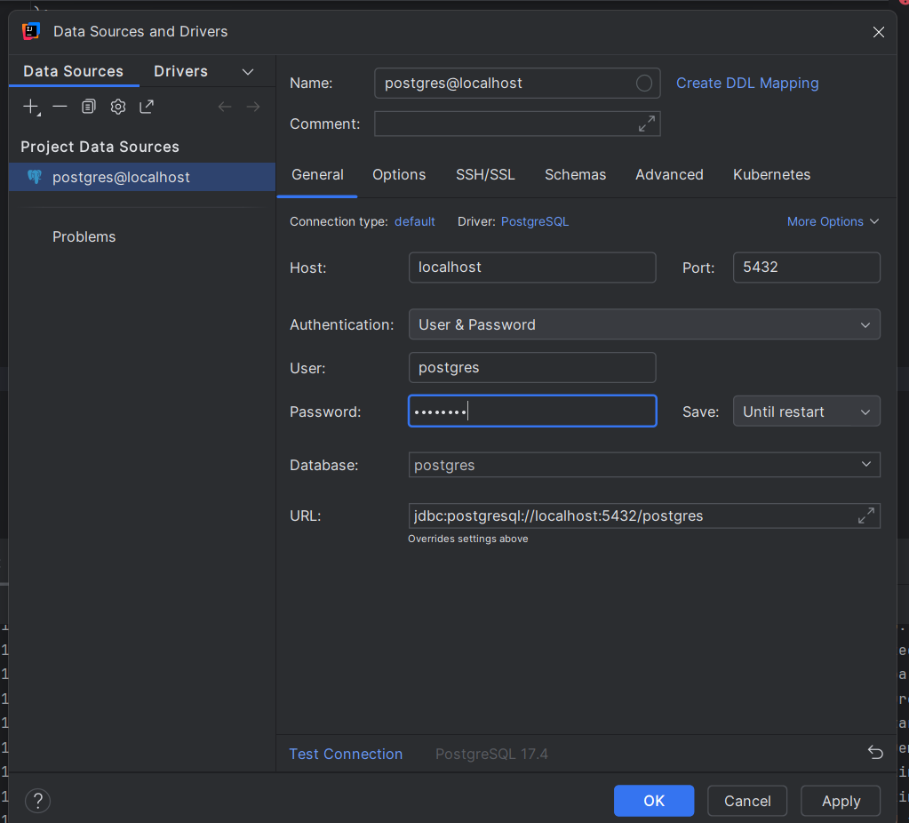

# uk223 Skeleton

## Quick Links

- Homepage: http://localhost:3000
- Login: http://localhost:3000/login
- User Component: http://localhost:3000/users

## Prerequisites

Before you start, make sure you have the following installed on your computer:

- **Node.js** (version 16 or higher)
  - Download from: https://nodejs.org/
  - To check if installed, open a terminal and run: `node --version`
- **Yarn** (package manager)
  - After installing Node.js, install Yarn by running: `npm install -g yarn`
  - To check if installed, run: `yarn --version`
- **Git** (version control)
  - Download from: https://git-scm.com/
  - To check if installed, run: `git --version`

## Setup Instructions

### 1. Clone the Repository

Open a terminal (Command Prompt, PowerShell, or Terminal) and run:

```bash
git clone <repository-url>
cd react_frontend
```

### 2. Install Dependencies

Install all required packages by running:

```bash
yarn install
```

This will download all the libraries and tools needed for the project.

### 3. Start the Development Server

Run the following command to start the application:

```bash
yarn dev
```

The application will open at http://localhost:3000

### 4. Stop the Development Server

To stop the server, press `Ctrl + C` in the terminal.

## Setup and Instructions for Backend

### 1. Clone the Repository

Open a terminal (Command Prompt, PowerShell, or Terminal) and run:

```bash
git clone <https://github.com/FelipeSpiderman/uek223_team4_backend>
```

Open the Project Folder in Intellij:

```bash
cd uek223_team4_backend
```

### 2. Refresh gradle packages

On the right side of Intellij, you see an Elephant, which is the Gradle icon.
You can open the right panel by clicking on the icon, and then refresh the gradle
packages, by clicking on the refresh icon.

### 3. Setup Database in the docker container

To setup the Database run the following commands by order:

1. Create docker container with postgres

```bash
docker run --name postgres_db -e POSTGRES_USER=postgres -e POSTGRES_PASSWORD=postgres -p 5432:5432 -d postgres
```

2. Verify it's running

```bash
docker ps
```

3. Check if you can log in to postgres (optional)

```bash
docker exec -it postgres_db psql -U postgres
```

The Backend Application should automatically connect with the Database in docker

### 4. Execute all the sql scripts

For our Application, you need to execute the sql scripts

You can do this, by rihgt clicking on the sql file and selecting run. In the run settings, you would need to establish a connection with your db. These are the settings that you'll need

you practically need to insert "postgres" into:

- user
- password
  Once you apply this setting for the connection with your database in intellij, you will be able to execute the sql scripts and the index will be executed to you dockerized database.

### 5. Execute bootRun with Gradle

You can execute BootRun if you click on the Elephant again, navigate to Tasks, then to application and lastly click on bootRun

### 6. Stop the Application

#### Potential issues

You might encounter an Error during the process by starting the Backend.
The Reasons could be:

1. The port SpringBoot usually uses is in use.
2. The Database is not set up correctly
3. The connection between the Database and the program doesn't work
4. You don't have Internet connection (SpringBoot needs it for dependencies)

## Common Commands

- `yarn dev` - Start the development server
- `yarn build` - Build the application for production
- `yarn test` - Run tests
- `yarn preview` - Preview the production build

## Project Structure

```
react_frontend/
├── src/               # Source code
│   ├── components/    # React components
│   ├── pages/         # Page components
│   └── ...
├── public/            # Static files
├── package.json       # Project dependencies
└── README.md          # This file
```
Backend:

````
## Projektstruktur

```text
src/
├── main/
│   ├── java/
│   │   └── com/
│   │       └── example/
│   │           └── demo/
│   │               ├── core/
│   │               │   ├── exception/
│   │               │   ├── generic/
│   │               │   └── security/
│   │               ├── domain/
│   │               │   ├── authority/
│   │               │   ├── event/
│   │               │   ├── role/
│   │               │   └── user/
│   │               └── DemoApplication.java
│   └── resources/
│       ├── application.properties
│       └── data.sql

````

## Testing

For Testing Cypress is being used. On Cypress, you would be using End-to-End testing and need to do the following.

1. Install Cypress

- `yarn add Cypress`
  or
- `npm install Cypress`

2. Open / Execute Cypress
   To open cypress with the GUI:

- yarn cypress open
- npx cypress open
  To Execute a single File using CLI:
- `npx cypress run --record --spec "path/to/your/cypress/e2e/my-test.cy.js"`
  or
- `yarn cypress run --record --spec "path/to/your/cypress/e2e/my-test.cy.js"`


## Troubleshooting

### Port Already in Use

If you see an error that port 3000 is already in use:

1. Stop any other applications running on port 3000
2. Or change the port in your configuration

### Installation Errors

If you encounter errors during `yarn install`:

1. Delete the `node_modules` folder and `yarn.lock` file
2. Run `yarn install` again
3. Make sure you have the correct Node.js version (16+)

### Need Help?

If you're stuck, ask your instructor or check the project documentation.

## Components
=======

